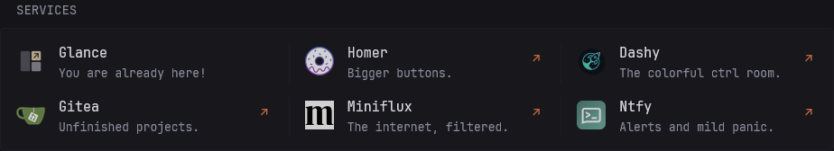
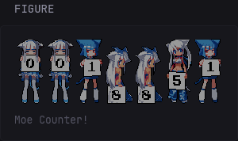

# undecV's Custom Widgets for Glance

A collection of custom widgets for [Glance](https://github.com/glanceapp/glance).

## `custom-api`

### [Bigger Bookmarks](./widgets/bigger-bookmarks/README.md)

A Monitor-style bookmark launcher with optional icons, descriptions, and link arrows, without health checking or service monitoring.

### [Figure Card](./widgets/figure-card/README.md)

A simple image widget with an optional caption, internal frame, and padding controls.

## How to Use

Refer to the official [Glance repository](https://github.com/glanceapp/glance) for installation, configuration, and `custom-api` documentation.

For additional examples and conventions, see [Glance Community Widgets](https://github.com/glanceapp/community-widgets).
