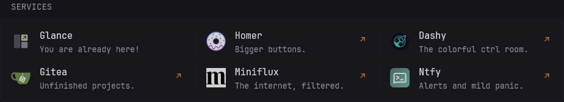

# Bigger Bookmarks

A Monitor-style bookmark launcher with optional icons, fallback images, descriptions, and link arrows, without health checking or service monitoring.

## Widget Type

`custom-api`

## Preview



## Options

Unlike Glance's native Bookmarks widget, *Bigger Bookmarks* does not support groups. Each configured link is rendered as an individual Monitor-style item in a responsive multi-column layout.

| Name            | Type    | Required | Default              |
| --------------- | ------- | -------- | -------------------- |
| `color`         | string  | No       | Glance primary color |
| `hide-arrow`    | boolean | No       | `false`              |
| `icon-fallback` | string  | No       | No fallback image    |
| `links`         | array   | Yes      | —                    |

### `color`

Sets the color of the right-side `↗` indicator.

Use Glance's HSL value format, such as `20 50 50`. When omitted, the arrow uses Glance's primary color (`color-primary`). This option does not change the title or icon color.

### `hide-arrow`

Controls whether the right-side `↗` indicator is shown by default.

Individual links may override this setting through `links[].hide-arrow`.

### `icon-fallback`

An optional replacement image used when a configured icon fails to load. Individual links inherit this value unless they override it through `links[].icon-fallback`.

Use a directly loadable image URL or a local asset path such as `/assets/icons/fallback.svg`. Add the `auto-invert` prefix when a monochrome fallback should be inverted in Glance's dark color scheme:

```yaml
icon-fallback: /assets/icons/fallback.png
icon-fallback: auto-invert /assets/icons/fallback.svg
icon-fallback: auto-invert https://example.com/fallback.svg
```

Fallback images do not support icon library shorthand (`si:`, `mdi:`, `di:`, or `sh:`), including when combined with `auto-invert`.

The fallback is attempted once. Its inversion behavior depends only on its own `auto-invert` prefix, independently of the original icon: an unprefixed fallback clears the original icon's inversion, while a prefixed fallback enables it. If no fallback is configured, or the fallback also fails to load, the image is hidden while its layout space is preserved. Links without an `icon` remain text-only, even when a global fallback is configured.

### `links`

A list of bookmark entries. Links are rendered in the same order as the YAML configuration.

| Name                    | Type    | Required | Default                          |
| ----------------------- | ------- | -------- | -------------------------------- |
| `links[].title`         | string  | Yes      | —                                |
| `links[].url`           | string  | Yes      | —                                |
| `links[].icon`          | string  | No       | No icon                          |
| `links[].icon-fallback` | string  | No       | Inherits `options.icon-fallback`  |
| `links[].description`   | string  | No       | No description                   |
| `links[].same-tab`      | boolean | No       | `false`                          |
| `links[].target`        | string  | No       | `_blank`                         |
| `links[].hide-arrow`    | boolean | No       | Inherits `options.hide-arrow`     |

#### `links[].title`

The displayed bookmark name.

#### `links[].url`

The destination URL. The entire item is clickable.

#### `links[].icon`

An optional icon specified as a direct image URL, local image path, or Glance-compatible icon shorthand.

Supported forms include:

```yaml
icon: https://example.com/favicon.ico
icon: /assets/icons/example.svg

icon: si:immich
icon: mdi:camera
icon: di:immich
icon: sh:immich
```

Supported icon libraries:

| Prefix | Library                                                           | Auto-inverted |
| ------ | ----------------------------------------------------------------- | :-----------: |
| `si:`  | [Simple Icons](https://simpleicons.org/)                          |      Yes      |
| `mdi:` | [Material Design Icons](https://pictogrammers.com/library/mdi/)   |      Yes      |
| `di:`  | [Dashboard Icons](https://github.com/homarr-labs/dashboard-icons) |       No      |
| `sh:`  | [selfh.st Icons](https://selfh.st/icons/)                         |       No      |

Simple Icons and Material Design Icons use SVG files. Dashboard Icons and selfh.st Icons use SVG by default and also support an explicit `.png` extension:

```yaml
icon: di:immich.png
icon: sh:immich.png
```

Use the `auto-invert` prefix for a monochrome icon that should be inverted in Glance's dark color scheme:

```yaml
icon: auto-invert /assets/icons/example.svg
icon: auto-invert https://example.com/icon.svg
icon: auto-invert di:example
```

Simple Icons and Material Design Icons automatically use this behavior.

`auto-invert` is intended for monochrome icons. Applying it to a colored image may produce unexpected colors in dark mode.

The icon shorthand and `auto-invert` behavior imitate Glance's native icon parser so that existing icon values can be reused whenever possible. However, *Bigger Bookmarks* implements this parsing independently inside its custom template. Exact compatibility with Glance's current or future parser behavior is therefore not guaranteed.

Unknown prefixes are treated as regular image URLs or paths.

#### `links[].icon-fallback`

Overrides the widget-level fallback image for this link. It accepts the same directly loadable image URLs and local asset paths as `options.icon-fallback`, with an optional `auto-invert` prefix and no icon library shorthand support. The override replaces the entire fallback value, so include `auto-invert` on the override if that image needs inversion.

Set `icon-fallback: ""` to explicitly disable the inherited fallback for a link. The fallback is only used if the link has a configured `icon` and that image fails to load.

#### `links[].description`

Optional subdued text displayed below the title.

#### `links[].same-tab`

Opens the link in the current tab when set to `true`.

#### `links[].target`

Sets the HTML link target.

Common values include `_blank`, `_self`, `_parent`, and `_top`, but any valid HTML link target is accepted.

When a non-empty `target` and `same-tab` are both configured, `target` takes precedence.

#### `links[].hide-arrow`

Overrides the widget-level `hide-arrow` setting for this link.

An explicit `false` also overrides a global `hide-arrow: true`.

## Configuration

The configuration below defines the template with the YAML anchor `&bigger-bookmarks-template`. For additional *Bigger Bookmarks* widgets in the same YAML document, use `template: *bigger-bookmarks-template` and provide each widget's own `options`.

```yaml
- type: custom-api
  title: Bigger Bookmark
  options:
    color: 20 50 50
    hide-arrow: false
    links:
      - title: Title
        url: https://example.com/
        icon: si:github
        description: Description
        same-tab: false
        target: _blank
        hide-arrow: false
  template: &bigger-bookmarks-template |
    {{ $links := index .Options "links" }}
    {{ $globalHideArrow := .Options.BoolOr "hide-arrow" false }}
    {{ $globalIconFallback := .Options.StringOr "icon-fallback" "" }}
    {{ $color := .Options.StringOr "color" "" }}

    <style>
      .item-bigger-bookmarks {
        min-width: 0;
        display: flex;
      }

      .link-bigger-bookmarks {
        width: 100%;
        height: 100%;
        min-height: 5rem;
        padding: 0.75rem 0;
        border-radius: var(--border-radius);
        text-decoration: none;
      }

      .icon-bigger-bookmarks {
        display: block;
        opacity: 0.8;
        filter: grayscale(0.4);
        object-fit: contain;
        aspect-ratio: 1 / 1;
        width: 3.2rem;
        position: relative;
        top: -0.1rem;
        transition: filter 0.3s, opacity 0.3s;
        flex-shrink: 0;
        border-radius: var(--border-radius);
      }

      .icon-bigger-bookmarks.flat-icon {
        opacity: 0.7;
      }

      .link-bigger-bookmarks:hover .icon-bigger-bookmarks {
        opacity: 1;
      }

      .link-bigger-bookmarks:hover .icon-bigger-bookmarks:not(.flat-icon) {
        filter: grayscale(0);
      }

      .status-icon-bigger-bookmarks {
        flex-shrink: 0;
        margin-left: auto;
        width: 2rem;
        height: 2rem;
        display: flex;
        align-items: center;
        justify-content: center;
      }

      .arrow-bigger-bookmarks {
        display: block;
        text-align: center;
        font-size: 1.15em;
        line-height: 1;
      }
    </style>

    <ul class="dynamic-columns list-gap-20 list-with-separator">
    {{ range $link := $links }}

      {{/* Native Bookmarks target semantics */}}
      {{ $target := "_blank" }}
      {{ if index $link "same-tab" }}
        {{ $target = "" }}
      {{ end }}
      {{ with $configuredTarget := index $link "target" }}
        {{ $target = $configuredTarget }}
      {{ end }}

      {{/*
        Link-level hide-arrow overrides widget-level hide-arrow,
        including an explicit false override.
      */}}
      {{ $hideArrow := $globalHideArrow }}
      {{ $rawHideArrow := index $link "hide-arrow" }}
      {{ if eq (printf "%T" $rawHideArrow) "bool" }}
        {{ $hideArrow = $rawHideArrow }}
      {{ end }}

      <li class="item-bigger-bookmarks">
        <a
          class="link-bigger-bookmarks flex items-center gap-15"
          href="{{ index $link "url" }}"
          {{ if $target }}target="{{ $target }}"{{ end }}
          rel="noopener noreferrer"
          title="{{ index $link "title" }}"
        >
          {{ with $configuredIcon := index $link "icon" }}
            {{ $icon := printf "%s" $configuredIcon }}
            {{ $iconURL := $icon }}
            {{ $flatIcon := false }}

            {{/* Explicit auto-invert prefix */}}
            {{ if findMatch `^auto-invert ` $icon }}
              {{ $flatIcon = true }}
              {{ $icon = trimPrefix "auto-invert " $icon }}
              {{ $iconURL = $icon }}
            {{ end }}

            {{/* Simple Icons: SVG only, automatically inverted */}}
            {{ if findMatch `^si:` $icon }}
              {{ $iconName := trimPrefix "si:" $icon }}
              {{ $basename := replaceMatches `\..*$` "" $iconName }}

              {{ $iconURL = concat
                "https://cdn.jsdelivr.net/npm/simple-icons@latest/icons/"
                $basename
                ".svg"
              }}
              {{ $flatIcon = true }}

            {{/* Material Design Icons: SVG only, automatically inverted */}}
            {{ else if findMatch `^mdi:` $icon }}
              {{ $iconName := trimPrefix "mdi:" $icon }}
              {{ $basename := replaceMatches `\..*$` "" $iconName }}

              {{ $iconURL = concat
                "https://cdn.jsdelivr.net/npm/@mdi/svg@latest/svg/"
                $basename
                ".svg"
              }}
              {{ $flatIcon = true }}

            {{/* Dashboard Icons: SVG by default, PNG when requested */}}
            {{ else if findMatch `^di:` $icon }}
              {{ $iconName := trimPrefix "di:" $icon }}
              {{ $basename := replaceMatches `\..*$` "" $iconName }}
              {{ $extension := "svg" }}

              {{ if findMatch `\.png$` $iconName }}
                {{ $extension = "png" }}
              {{ end }}

              {{ $iconURL = concat
                "https://cdn.jsdelivr.net/gh/homarr-labs/dashboard-icons/"
                $extension
                "/"
                $basename
                "."
                $extension
              }}

            {{/* selfh.st Icons: SVG by default, PNG when requested */}}
            {{ else if findMatch `^sh:` $icon }}
              {{ $iconName := trimPrefix "sh:" $icon }}
              {{ $basename := replaceMatches `\..*$` "" $iconName }}
              {{ $extension := "svg" }}

              {{ if findMatch `\.png$` $iconName }}
                {{ $extension = "png" }}
              {{ end }}

              {{ $iconURL = concat
                "https://cdn.jsdelivr.net/gh/selfhst/icons/"
                $extension
                "/"
                $basename
                "."
                $extension
              }}
            {{ end }}

            {{/*
              A link-level empty string explicitly disables the global fallback.
              Fallback accepts a direct URL or /assets/... path, optionally
              prefixed with "auto-invert ".
            */}}
            {{ $iconFallback := $globalIconFallback }}
            {{ $rawIconFallback := index $link "icon-fallback" }}
            {{ if eq (printf "%T" $rawIconFallback) "string" }}
              {{ $iconFallback = $rawIconFallback }}
            {{ end }}

            {{ $fallbackURL := $iconFallback }}
            {{ $fallbackFlatIcon := false }}
            {{ if findMatch `^auto-invert ` $iconFallback }}
              {{ $fallbackURL = trimPrefix "auto-invert " $iconFallback }}
              {{ $fallbackFlatIcon = true }}
            {{ end }}

            
          {{ end }}

          <div class="grow min-width-0">
            <span class="size-h3 color-highlight text-truncate block">
              {{ index $link "title" }}
            </span>

            {{ with $description := index $link "description" }}
              <ul class="list-horizontal-text">
                <li>{{ $description }}</li>
              </ul>
            {{ end }}
          </div>

          {{ if not $hideArrow }}
            <span class="status-icon-bigger-bookmarks" aria-hidden="true">
              <span
                class="arrow-bigger-bookmarks{{ if not $color }} color-primary{{ end }}"
                {{ if $color }}style="color: hsl({{ $color }});"{{ end }}
              >↗</span>
            </span>
          {{ end }}
        </a>
      </li>

    {{ end }}
    </ul>
```

The widget does not define a widget-level `url`, so Glance does not perform a server-side request or health check.

Icon images are fetched directly by the browser. The `si:`, `mdi:`, `di:`, and `sh:` forms resolve to externally hosted jsDelivr icon files. Use a local path such as `/assets/icons/example.svg` when icons should instead be served from Glance's configured assets directory.

For example, add another widget after the template definition to configure a shared monochrome fallback with `auto-invert`, a per-link colored fallback without inversion, and a link with fallback disabled. Replace the asset paths with files in your own Glance assets directory:

```yaml
- type: custom-api
  title: More Bookmarks
  template: *bigger-bookmarks-template
  options:
    icon-fallback: auto-invert /assets/icons/fallback.svg
    links:
      - title: Shared Fallback
        url: https://example.com/
        icon: /assets/icons/example.svg
      - title: Custom Fallback
        url: https://example.com/custom
        icon: /assets/icons/custom.svg
        icon-fallback: /assets/icons/custom-fallback.png
      - title: No Fallback
        url: https://example.com/no-fallback
        icon: /assets/icons/optional.svg
        icon-fallback: ""
```
